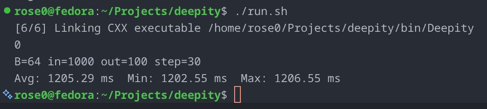
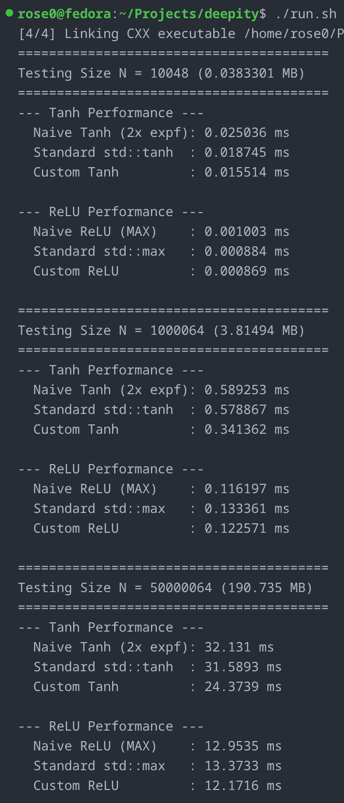

# 

Deepity is a Predictive Coding (PC) model library designed for ultra-low variance, high-speed inference and updating. The library is currently heavily CPU-optimized, with CUDA support on the horizon.

<p align="center">

</p>

### 🚀 Performance at a Glance
When running on optimized hardware (*a Dell Inc. Inspiron 16 Plus 7620 with a 12th Gen Intel® Core™ i7-12700H × 20*), Deepity hits a sustained execution speed that rivals embedded hardware:

$$
\frac{180\text{ GigaFLOPs}}{1.18956\text{ s}} \approx 151.32\text{ GFLOPS}
$$

*For reference, performing similar operations using standard academic libraries like `ngc-learn` typically yields under 15 GFLOPS due to high-level language memory overhead.*

---

## 🛠️ Example Usage

Getting a predictive coding layer up and running in Deepity is straightforward. Here is how you initialize a layer with strict 64-byte alignment and pass a data stream through it:

```cpp
#include "PCNLayer.h"
#include "Activations.h"
#include <vector>

int main(void) {

    // Initialize a layer: 1000 inputs, 100 outputs
    // Defaults: stepSize=30, activation=Deep::ReLU,
    // learning rate = inference rate = 1e-6
    Deep::PCLayer pc(1000, 100);

    // Your input data (must match pc.GetInputSize)
    std::vector<float> input_sample(1000, 0.5f);

    // Run inference and update beliefs/weights asynchronously
    pc.RunPrediction(input_sample.data());
    
    // If working with partial batches (or for good practice),
    // flush to finish
    pc.Flush();

    #ifdef _DEBUG
    pc.DebugStats();
    // Inspect layer health, NaNs, and checksums
    #endif

    return 0;
}

```

---

## ⚡ Core Architecture Features

* **Custom SIMD Activation Functions:** Deepity bypasses standard C++ library bottlenecks by implementing highly optimized activation functions using **AVX2** and **AVX-512** intrinsics.
* **High-Performance Tanh:** Bypasses expensive `expf` evaluations using a highly tuned **Padé rational polynomial approximation**, yielding up to a **~40% speedup** over `std::tanh`.

<p align="center">

</p>

* **Vectorized ReLU:** Processes up to 16 floats per clock cycle, completely saturating standard single-core RAM bandwidth limits (~15.8 GB/s).


* **Strict 64-byte Alignment:** To prevent hardware exceptions and segmentation faults when loading wide 256-bit or 512-bit registers, Deepity enforces strict **64-byte memory boundaries** (via `std::aligned_alloc`) for all internal sequential sub-buffers ($W$, $z$, $p$, $err$).

---

## 📅 Project Roadmap & WIP

Deepity is actively evolving. Here is what we are currently building and where we want to go:

* [x] **SIMD Micro-kernels:** Hand-crafted AVX2/AVX-512 Padé approximations for activations.
* [x] **Contiguous Flat-Memory Buffers:** Cache-friendly structure eliminating pointer-chasing overhead.
* [ ] **PCNetwork Abstraction (WIP)**: Creating a layer hierarchy class with more friendly implementation, as well as ports for Java and Python.
* [ ] **CUDA Accelerated Engine (WIP):** Moving the heavy `cblas_sgemm` operations to GPU data parallel structures for massive model scales.
* [ ] **API Reference Documentation (Upcoming):** We will soon be generating comprehensive **Doxygen** documentation for the entire codebase. Code commenting is underway to support clean, interactive HTML API guides.

---

## 📊 Single-Layer Informatics & Benchmarks

During our architectural design phase, we benchmarked several data pipelines to justify our design choices:

### 1. The Impact of Batch Size

Batching provides massive performance scaling. A batch size of **256** proved to be the exact sweet spot for maximum CPU throughput.

| Batch Size | Time (ms) |
| --- | --- |
| 1 (None) | 4484 |
| 16 | 3149 |
| 32 | 2634 |
| 64 | 2338 |
| 128 | 2263 |
| **256** | **2233** |
| 512 | 2265 |

### 2. Random Number Generation (RNG)

We compared `OpenRAND` against the standard C++ `std::mt19937` generator. The results were essentially identical (within a 5% margin of error).

* **OpenRAND:** 4712 ms
* **mt19937:** 4482 ms

### 3. Memory Layout: Contiguous vs. Separate

We measured separate heap vectors allocated to each layer attribute versus packing them into a single contiguous block (`arr`). The data showed zero penalty for the flat-array approach, leading us to adopt it for simpler memory alignment guarantees.

* **Separate Vectors:** 4481 ms
* **Contiguous Block:** 4484 ms

---

Ra4ster (Jack R) @ 2026 ❤️